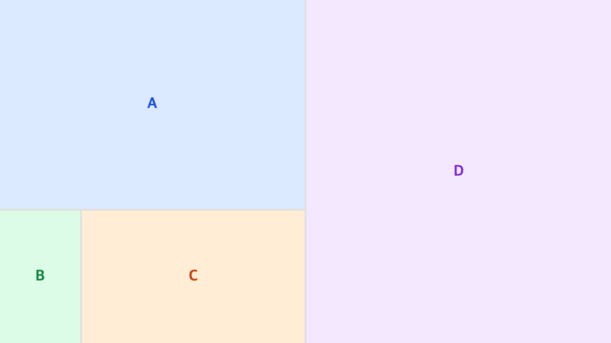
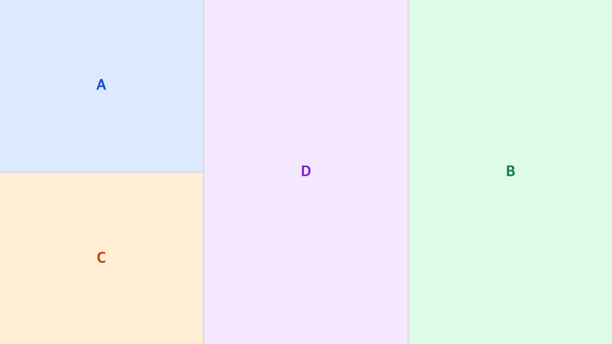

# react-tree-layout

[한국어 README](./README.ko.md)

Tree-based resizable and reorderable panel layout for React. Split panels horizontally or vertically, resize borders by dragging, and reorder panels via drag and drop — just like VS Code or any modern IDE.


---

## Features

- **N-ary tree structure** — `SplitNode` can hold two or more children, keeping the tree flat without unnecessary nesting
- **Border drag resize** — drag panel borders to resize (requestAnimationFrame optimized)
- **Drag-and-drop panel move** — reorder panels via HTML5 Drag & Drop API
- **Multi-level drop target** — distinguishes panel edge, parent split edge, and root edge for depth-aware placement
- **Immutable state** — all tree updates produce new objects via spread
- **View / State separation** — `TreeLayout` (rendering) and `useLayoutTree` (state) can be used independently
- **TypeScript** — full type declarations included
- **ESM + CJS** — dual-format bundle output

---

## Installation

```bash
npm install react-tree-layout
```

> **Peer dependencies**: `react >= 17`, `react-dom >= 17`

---

## Quick Start

```tsx
import { TreeLayout, useLayoutTree, type LayoutNode } from "react-tree-layout";

const initialTree: LayoutNode = {
  type: "split",
  direction: "horizontal",
  size: 1,
  children: [
    {
      type: "panel",
      id: "panel-a",
      size: 1,
      component: <div style={{ padding: 16, background: "#dbeafe", height: "100%" }}>Panel A</div>,
    },
    {
      type: "split",
      direction: "vertical",
      size: 1,
      children: [
        {
          type: "panel",
          id: "panel-b",
          size: 1,
          component: <div style={{ padding: 16, background: "#dcfce7", height: "100%" }}>Panel B</div>,
        },
        {
          type: "panel",
          id: "panel-c",
          size: 1,
          component: <div style={{ padding: 16, background: "#ffedd5", height: "100%" }}>Panel C</div>,
        },
      ],
    },
  ],
};

const App = () => {
  const { tree, resizeBorder, movePanel } = useLayoutTree(initialTree);

  return (
    <div style={{ width: "100vw", height: "100vh" }}>
      <TreeLayout tree={tree} onResizeBorder={resizeBorder} onMovePanel={movePanel} />
    </div>
  );
};
```

---

## API

### `<TreeLayout />`

Recursively renders the layout tree using flexbox.

| Prop | Type | Required | Description |
|------|------|:--------:|-------------|
| `tree` | `LayoutNode` | Yes | Root node of the layout tree |
| `onResizeBorder` | `(path, borderIndex, delta) => void` | | Border resize callback |
| `onMovePanel` | `(sourceId, anchorId, position, depth) => void` | | Drag-and-drop move callback |
| `className` | `string` | | className for the root div |
| `style` | `CSSProperties` | | Inline style for the root div |
| `resizerClassName` | `string` | | className applied to every resizer border div |

### `useLayoutTree(initialTree)`

Hook for managing layout tree state.

```ts
const { tree, setTree, resizeBorder, splitPanel, removePanel, movePanel } = useLayoutTree(initialTree);
```

| Return | Type | Description |
|--------|------|-------------|
| `tree` | `LayoutNode` | Current layout tree state |
| `setTree` | `(tree: LayoutNode) => void` | Directly set the tree |
| `resizeBorder` | `(path, borderIndex, delta) => void` | Resize by border index |
| `splitPanel` | `(panelId, direction) => void` | Split a panel |
| `removePanel` | `(panelId) => void` | Remove a panel |
| `movePanel` | `(sourceId, anchorId, position, depth?) => void` | Move a panel |

---

## Types

```ts
type SplitDirection = "horizontal" | "vertical";

interface PanelNode {
  type: "panel";
  id: string;
  size: number;          // flex ratio
  component: ReactNode;  // content to render
}

interface SplitNode {
  type: "split";
  direction: SplitDirection;
  size: number;            // flex ratio
  children: LayoutNode[];  // two or more children
}

type LayoutNode = PanelNode | SplitNode;

type DropPosition = "top" | "bottom" | "left" | "right";
```

---

## Customization

### Resizer style

Use `resizerClassName` to fully control the border appearance via CSS:

```tsx
// styles.css
// .my-resizer { background: #6366f1; width: 2px; }
// .my-resizer:hover { background: #4f46e5; }

<TreeLayout
  tree={tree}
  onResizeBorder={resizeBorder}
  resizerClassName="my-resizer"
/>
```

The default inline styles (4 px wide, `#e0e0e0` background) are still applied as a base; `className` lets you override them via CSS specificity or your preferred styling solution.



### Drag-and-drop



`movePanel(sourceId, anchorId, position, depth)` — moves a panel to another location.

- `position`: drop side relative to the anchor panel (`top` / `bottom` / `left` / `right`)
- `depth`: 0 = panel level, 1 = parent split level, higher = ancestor split level

**Drop target priority:**
1. Root edge (outer 5%) — places at the top level
2. Parent split edge (outer 15%) — places at the enclosing split level
3. Panel center — splits at the panel level

---

## License

ISC
