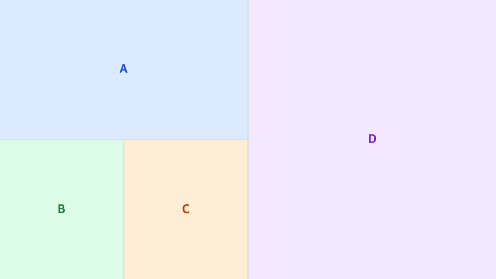

# @dannysir/floating-components

[한국어 README](./README.ko.md) · [API Reference](./doc/API.md)

Tree-based resizable and reorderable panel layout for React. Split panels horizontally or vertically, resize borders by dragging, and reorder panels via drag and drop — just like VS Code or any modern IDE.



---

## Features

- **N-ary tree structure** — `SplitNode` can hold two or more children, keeping the tree flat without unnecessary nesting
- **Border drag resize** — drag panel borders to resize (requestAnimationFrame optimized)
- **Drag-and-drop panel move** — reorder panels via HTML5 Drag & Drop API
- **Multi-level drop target** — distinguishes panel edge, parent split edge, and root edge for depth-aware placement
- **Immutable state** — all tree updates produce new objects via spread
- **View / State separation** — `TreeLayout` (rendering) and `useLayoutTree` (state) can be used independently
- **TypeScript** — full type declarations included
- **ESM + CJS** — dual-format bundle output

---

## Installation

```bash
npm install @dannysir/floating-components
```

> **Peer dependencies**: `react >= 18`

---

## Quick Start

```tsx
import { TreeLayout, useLayoutTree, type LayoutNode } from "@dannysir/floating-components";

const initialTree: LayoutNode = {
  type: "split",
  direction: "horizontal",
  size: 1,
  children: [
    {
      type: "panel",
      id: "panel-a",
      size: 1,
      component: <div style={{ padding: 16, background: "#dbeafe", height: "100%" }}>Panel A</div>,
    },
    {
      type: "split",
      direction: "vertical",
      size: 1,
      children: [
        {
          type: "panel",
          id: "panel-b",
          size: 1,
          component: <div style={{ padding: 16, background: "#dcfce7", height: "100%" }}>Panel B</div>,
        },
        {
          type: "panel",
          id: "panel-c",
          size: 1,
          component: <div style={{ padding: 16, background: "#ffedd5", height: "100%" }}>Panel C</div>,
        },
      ],
    },
  ],
};

const App = () => {
  const { tree, resizeBorder, movePanel } = useLayoutTree(initialTree);

  return (
    <div style={{ width: "100vw", height: "100vh" }}>
      <TreeLayout tree={tree} onResizeBorder={resizeBorder} onMovePanel={movePanel} />
    </div>
  );
};
```

---

## Recipes

### Toggle panel visibility

```tsx
const { panelIds, removePanel, insertPanel } = useLayoutTree(initialTree);

const togglePanel = (id: string, component: ReactNode) => {
  if (panelIds.includes(id)) {
    removePanel(id);
  } else {
    insertPanel({ panel: { id, component } });
  }
};
```

---

## Drag & Drop

Drag any panel to reorder. A translucent preview of the drop target follows the cursor, and dropping near different regions produces different placements:


- Drop on the **panel center** → split the hovered panel
- Drop near the **enclosing split's edge** → place as a sibling of the parent split
- Drop near the **root's edge** → place at the top level

Wire it up with `useLayoutTree`'s `movePanel`:

```tsx
<TreeLayout tree={tree} onResizeBorder={resizeBorder} onMovePanel={movePanel} />
```

See [API Reference → Drag & Drop](./doc/API.md#drag--drop) for the full placement rules and the `depth` parameter.

---

## Documentation

- **[API Reference](./doc/API.md)** — full props, hook return values, tree utilities, types
- **[CHANGELOG](./CHANGELOG.md)**

---

## License

ISC
